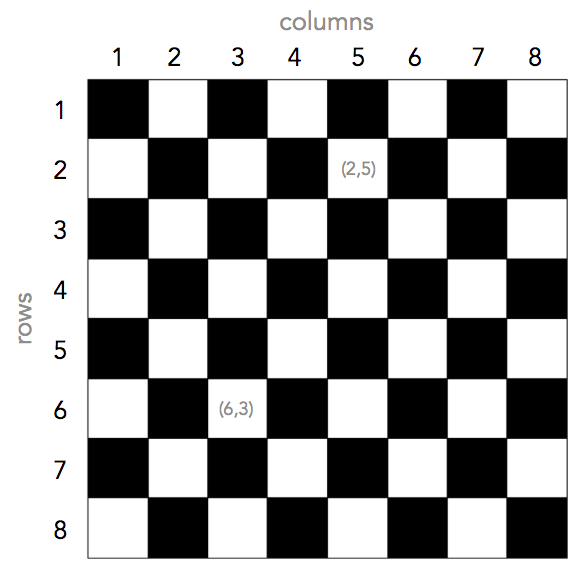

#  Chess Minimum Moves

**Objective** (without divulging too much): Finding the minimum number of turns to get to goal position.


### Chess Board

I used a grid of 8 rows and 8 columns to model the chess board.



## Getting Started

These instructions will get you a copy of the project up and running on your local machine for testing purposes.

### Prerequisites

The project uses basic packages and modules: numpy, operator, os, and argparse


### Cloning

You can clone the repository to your local machine by entering the following command in your terminal:

```
git clone https://github.com/edtky/chess_min_moves.git
```

## Running the tests (test.py)

I have designed 9 happy (normal) and 5 sad (edge) test cases. 

To run the test cases, enter this command in your terminal:

```
python test.py
```

### Test Cases

**Happy Cases**
1. 'king', (3,7), (3,4) -> king moves straight only
2. 'king', (6,1), (1,6) -> king moves diagonally only
3. 'king', (3,7), (5,1) -> king moves diagonally and straight
4. 'knight', (3,6), (5,7) -> knight takes 1 turn
5. 'knight', (3,6), (5,3) -> knight takes 3 turns
6. 'knight', (3,1), (3,8) -> knight takes 5 turns
7. 'bishop', (3,2), (5,1) -> goal is unreachable for bishop
8. 'bishop', (6,1), (1,6) -> bishop takes 1 turn
9. 'bishop', (6,1), (3,8) -> bishoptakes  2 turns

**Sad Cases**
1. 'pawn', (3,2), (5,1) -> invalid chess piece
2. 'king', (9,2), (5,1) -> position outside chess board
3. 'king', (3,2.0), (5,1) -> element in tuple not integer
4. 'king', [3,2], [5,1] -> lists instead of tuple
5. 'king', (5,5), (5,5) -> same start and end positions


## Using the main script (chess.py)

To try new cases with the script, run the code in the following format in your terminal:
```
python chess.py [PIECE] [START] [END]
```

where [PIECE] is a string representing the chess piece, and [START] and [END] are 2-digits representing the row and column index of the start and end points.

For example, to find the minimum number of turns for a king to move from (1,3) to (3,7), use:
```
python chess.py king 13 37
```

### Output

The script will print the minimum number of turns and the shortest path.

## Using the functions

To use the functions I have defined in **chess.py**, you can import the python file as a module using:

```
import chess
```


## Author

**Edward Tiong**

If you face any issues or have any questions, please contact me at edwardtky@berkeley.edu


## Acknowledgments

**Edsger W. Dijkstra** for helping me find the shortest path.
